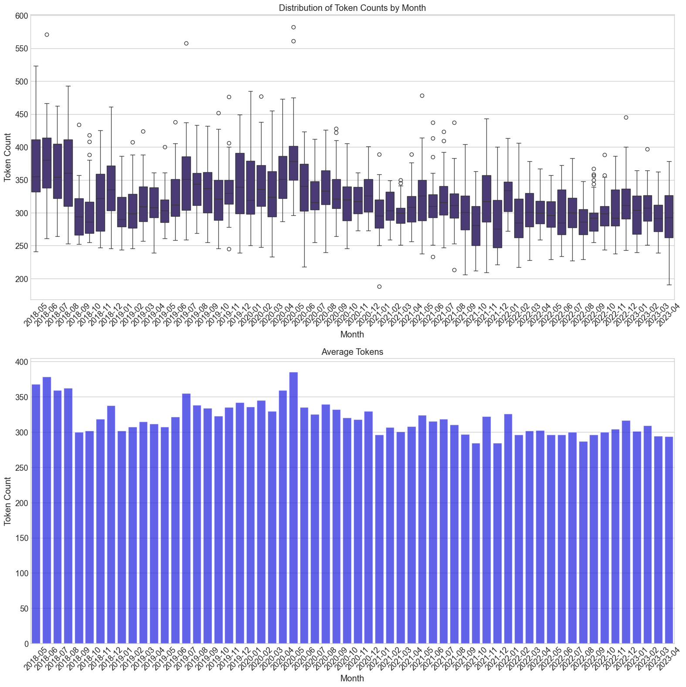
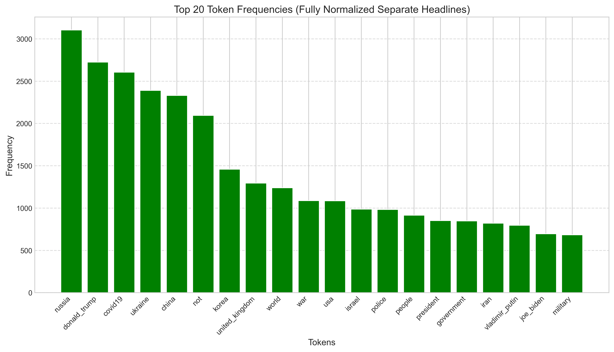
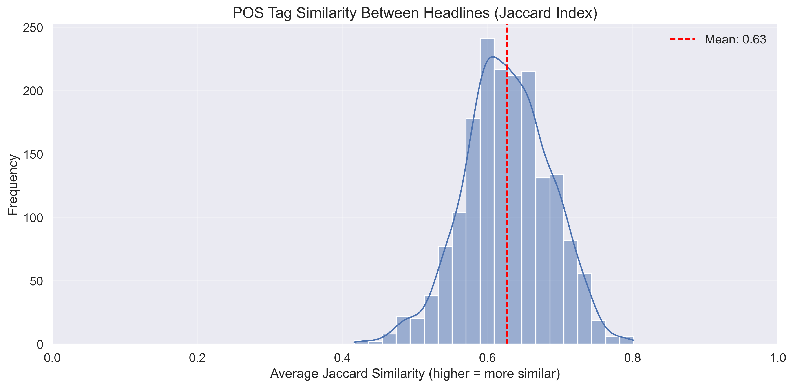
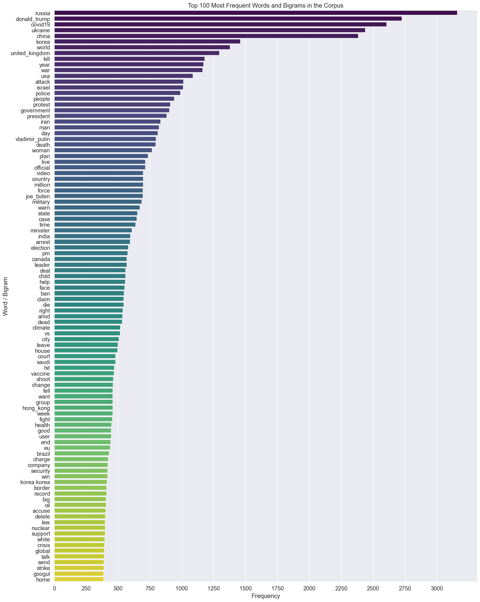
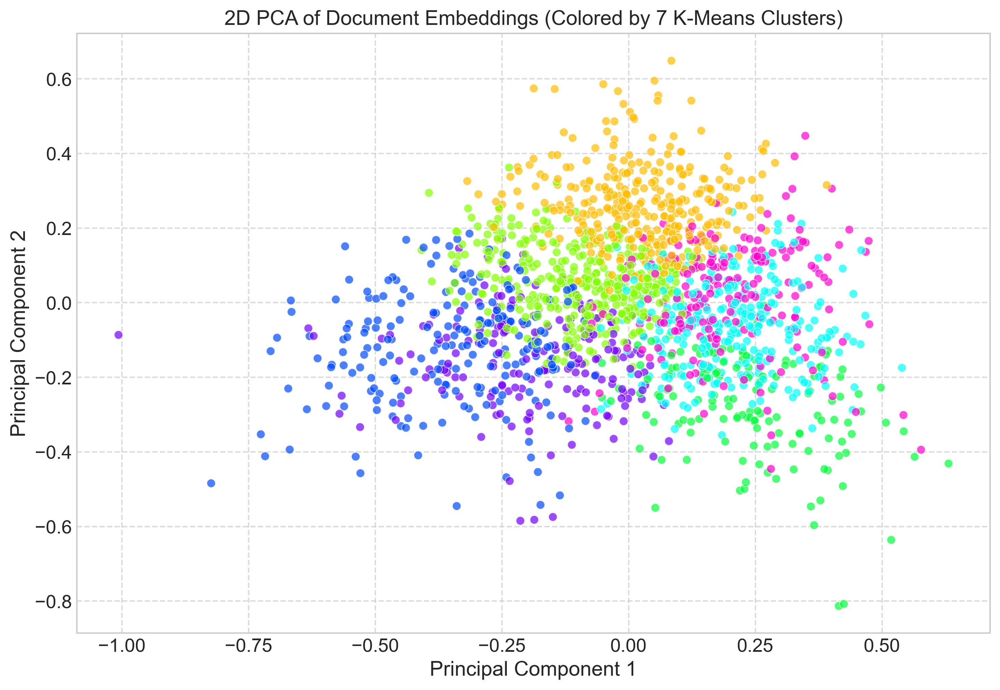
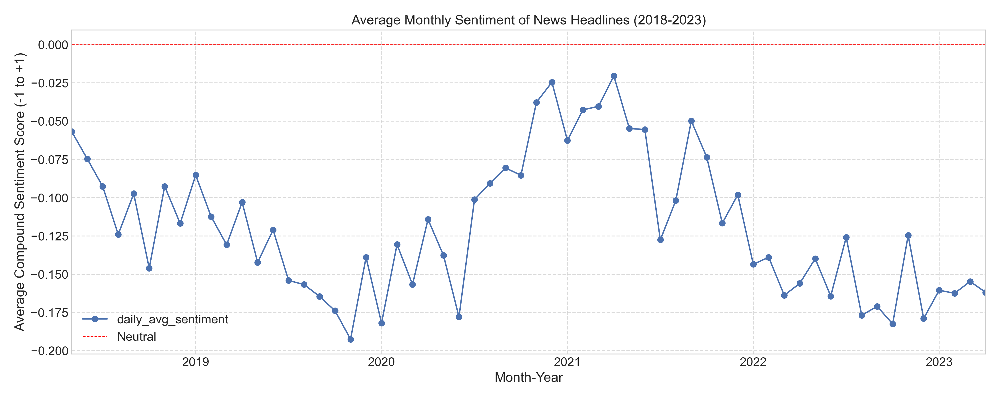
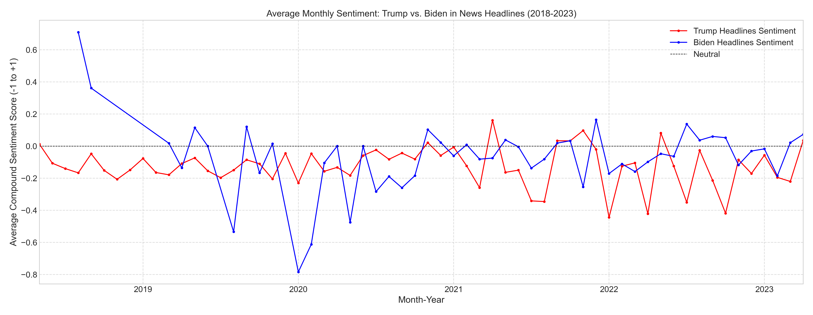

# 📰 NLP News Headlines Analysis (2019–2023)


A comprehensive natural language processing (NLP) project analyzing global news headlines from 2019 to 2023. The focus is on extracting insights from language trends, sentiment patterns, and entity frequencies using classic NLP techniques.

Read headlines.ipynb to learn how it is done, and follow along my *TUTORIAL*!
***

## 📌 Project Highlights
✅ Cleaned and normalized thousands of real-world news headlines

✅ Removed stopwords and unified variations of key terms (e.g., "coronavirus" vs. "covid")

✅ Performed tokenization, lemmatization, and POS tagging

✅ Extracted named entities and top keywords

✅ Conducted sentiment analysis over time

✅ Visualized trends using matplotlib and seaborn

***


## 🧠 Techniques & Libraries Used

## Purpose Tools & Libraries

Data Handling:	pandas, numpy

NLP Core, POS Tagging & NER:  nltk, spaCy

Visualization:	matplotlib, seaborn

Sentiment Analysis:	nltk.sentiment.vader

Practices: Normalization, Lowercasing, Token Unification, Lemmatization


***


# 🔍 Key Features


## 📅 Temporal Sentiment Trends

Sentiment score evolution from 2019 to 2023

Visualized sentiment polarity by month/year and plotted using matplotlib 

## 🗣️ Token Frequency Analysis

Top tokens after removing stopwords

Unified semantically similar tokens (e.g., "covid" + "coronavirus")

##  📈 Sentimental Derivative 

📊 Avg. tokens per headline

📅Distribution of sentence/token counts

📦 Token frequency bar charts

📉 Sentiment score over time

📊 Box plots of token counts per month

🔠 Named Entity Recognition (NER) counts

# Project Findings and Results

This will be a very short summary for the project findings. For a more thorough examination, go trough headlines.ipynb. 


This is our starting data, total number of headlines we have per month to analyze. It averages around 25 per day.


## Token Analysis
 

*  **Token Distribution**

 This is the average tokens we have per month to analyze.



*  **Token Frequencies**

This has implications we will mention later.



## Part Of Speech Tags Analysis

*  **POS Tag Distribution**

We can see that around 66% of headlines are made of nouns (proper nouns and common nouns combined.). Data representing numbers and such cannot be trusted as we are stripping them in our normalization. 

Nouns are followed by verbs and adjectives.

!!! 66/20 verb noun ratio is higher than what we see in literary context by an order of 4 to 5, according to 'Academia L1 English Verb to Noun Ratio' results.


* **Word Clouds**

 Covid is NOT the most talked about topic even though it felt like that living through that era, it was actually Donald Trump. More info about this later!

 Russia, China and Ukraine was the 3 countries that news outlets talked the most about


* **Headline POS Tag Sequence Patterns**

 24.3% of 3 word sequences are made out of either proper nouns or common nouns,

 22.1% of 3 words sequences include a verb.
 
 *I wonder if this will have serious implications with the future graphs?..*


* **Headline Length Analysis**

59.86% of headlines are 6 to 9 words. There is a clear trend here, probably this is the **golden spot** that makes us click more. *Not too long to lose your attention, not too short to miss your attention.*


* **Headline Similarity (Jaccard Index)**

The finding that 63% of leading daily headlines adhere to a **comparable grammatical structure** indicates that 
the effectiveness of news conveyance extends beyond our acknowledgment of 6-9 word count. 
*Rather, it underscores the importance of a consistent approach in their utilization of various parts of speech.*



## Feature Extraction

* **Bag of Words**

Donald Trump, somehow, is mentioned even more than covid!



* **TF-IDF Visualization**

These are terms that are frequently identified as important (having high TF-IDF scores) in *many different documents* within the collection. They are not just common words (IDF would penalize those), but rather words that are consistently good at describing the content of various documents.
This means that while Donald Trump was talked about more, covid19 had more distinguished topics just about it, it was a defining word, a recurring concept.


## Word Embeddings

* **Embedding Norms**

This bell-shaped distribution shows that the magnitudes (L2 norms) of the news headline embeddings are mostly similar, clustering around a central value. This suggests a degree of uniformity in how the embedding model represents these headlines, meaning their vector 'lengths' don't vary drastically across the dataset.


This graph demonstrates that the news headline embeddings, when simplified into two dimensions, reveal underlying thematic groupings. The distinct colored clusters suggest that the K-Means algorithm was able to identify and separate headlines with related semantic content.



## Sentiment Analysis

* **ALL the News headlines average of a month are negative!** 
 There are no months in 2018-2023 that we had more positive news than negative ones. They are all BELOW 0.00

Is this because bad news are more controversial thus clicked more, and make it easier to top 25? Or is it actually because there are more bad things happening in the world rather than good? 




## Lets analyze Trump VS Biden.




# **Results reflect the election results!**

Checking past News and surveys most people thought Trump was winning again, but News analysis gives as better results. 

January 2020 dip of Biden is probably the Hunter Biden controversy. 

Downfall and then uprise of Donald Trump at 2021 correlates with the The Capitol Riot. 

It seems most headlines were negative for both candidates. It feels like Americans are searching for a 3rd option, but aren't willing to vote for one.

More headlines were negative for Trump than for Biden: Is Trump associated with bad things more, or is the traditional media democrat leaning like what Trump suggests?

More advanced topics such as topic modeling (LDA) and transformer-based models (like DistilBERT) may be added in future iterations.

---
# 🚀  Getting Started

## Option A

1. Clone the repo

```
git clone https://github.com/emrehannn/NLPNewsAnalyzer.git

```

2. Run run.bat for automatic installation of dependencies.

## Option B

1. Clone the repo

```
git clone https://github.com/emrehannn/NLPNewsAnalyzer.git

```
2. create a virtual environment

```
python -m venv venv

```


3. Install dependencies 

```
pip install -r requirements.txt

```

4. install spacy medium model

```
python -m spacy download en_core_web_md

```

5. Launch JupyterLab

```
jupyter lab

```


## 🙋‍♂️ Author
Emre — solo developer passionate about data science and NLP.

Feel free to connect or contribute!

🧭 Future Plans
 Integrate topic modeling (LDA)

 Add more entity co-occurrence graphs

 Compare results using transformer models like DistilBERT
